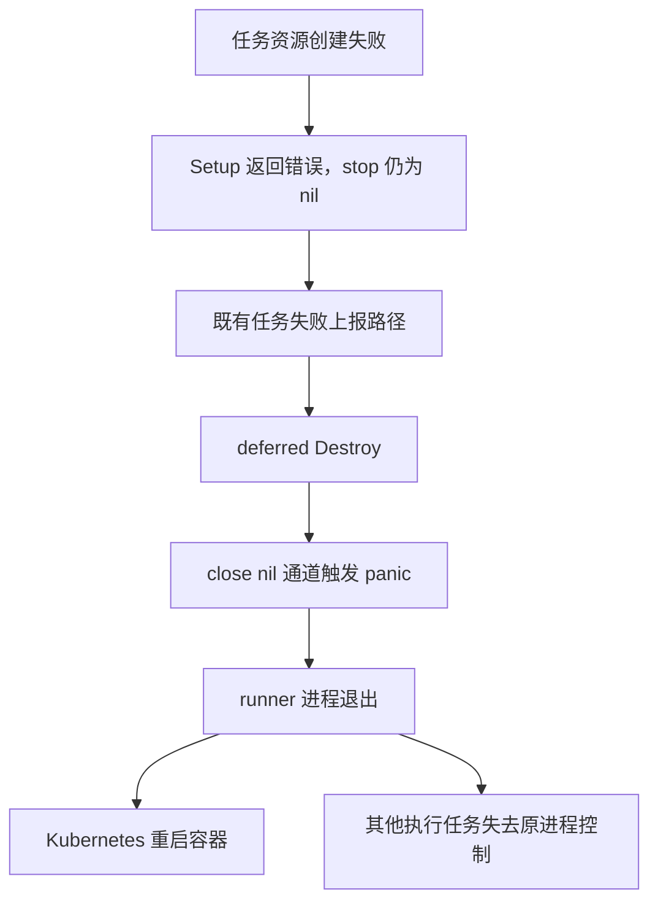

# fixbug: 单个任务初始化失败导致整个 runner 崩溃

日期：2026-09-22。状态：**已修复并结案，补充专项测试已通过**。修复复用关联提交 `6b8c15b`；随后按用户要求补齐本地初始化失败、并发清理和同进程任务隔离测试，结果见第 6 节。线上发布状态未在本轮核验。

缺陷分析基线：`018c41607ac6366a59beaa9a2cf497669dc07258`，`runner-go v1.12.0`。

修复提交：`6b8c15b48fd76f05f8ce5da05f3dcc2347394df5`（2026-09-22 18:54:49 +08:00），`fix: make Kubernetes task cleanup resilient to failures and restarts`。本轮新增测试、验收代理的 Go 1.16 兼容修正及本文更新作为后续补充提交交付，不属于该修复提交的原始内容。

第 2、3 节保留历史故障证据与旧代码行为；第 4、5 节记录已提交实现，第 6 节区分原有集群验收与本轮补充测试。历史线上快照不代表部署修复后的状态。

## 1. 修复目标与缺陷定义

**修复目标：fixbug: 单个任务初始化失败导致整个 runner 崩溃。**

已确认一条在 rc.3、rc.5 都实际发生的重启链路：创建任务资源失败，Setup 提前返回；Destroy 关闭尚未初始化的停止通道，引发 panic，导致整个 runner 进程退出。Kubernetes 随后按 `restartPolicy: Always` 重启容器。

缺陷的本质是：单个任务初始化失败，被异常清理代码扩大为整个 runner 进程崩溃。runner 领取 pipeline 后，创建 Namespace、拉取凭据 Secret、任务 Secret 或 Pod 失败，均应由当前任务按既有失败机制处理。

修复后的预期行为：

1. 当前任务保留初始化错误，按既有机制上报失败，并尝试清理已创建的资源。
2. kube runner 进程继续运行，同进程其他任务不因该初始化失败触发的 panic 中断。
3. 依赖服务可用、既有上报与清理调用返回后，runner 仍能领取和执行后续任务。

验收围绕上述已证实的缺陷展开。停止信号只关闭一次是保证修复正确的实现约束；API 网络故障治理、其他原因的重启、Pod 残留治理和跨重启恢复不属于本次修复目标。

## 2. 历史会话与本次取证

历史调查来自本目录中的《分析 Drone Runner Kube Pod积压》和《修复残留pod》。关联的 [Pod 残留治理设计](2026-09-21-runner-lifecycle-design.md)与[实施清单](../plans/2026-09-22-pod-cleanup-implementation.md)现已随 `6b8c15b` 提交，并包含本缺陷修复。该任务不包含阶段终态补报，不能沿用早期完整生命周期方案中的阶段补报范围。

时间统一为北京时间：

| 证据 | 观察结果 | 能支持的结论 |
| --- | --- | --- |
| 9 月 21 日旧实例，rc.3 | 08:38:23 创建任务 Secret 遇到 Kyverno webhook 超时；08:38:28 出现 `panic: close of nil channel`，栈指向 `Destroy`；历史调查记录退出码 2、累计重启 35 次 | 这一轮重启已有直接因果证据，不能将全部 35 次归为同一原因 |
| 9 月 22 日 15:41:43 读取当前实例，rc.5 | 当前 `Running`、Ready，重启次数 1；最近退出是 9 月 21 日 16:55:07，`Error / exitCode=2`，16:55:34 重新启动 | 升级后的实例也发生过异常退出；读取时未处于持续重启状态 |
| rc.5 上一容器日志 | 16:54:51 创建 Secret 返回 `http2: client connection lost`；16:55:07 删除 Secret 返回 `TLS handshake timeout`；紧接着出现同一 panic，栈指向 `engine_impl.go:128` | 无须 Kyverno 超时这一特定条件，普通 API 连接失败同样能触发缺陷；单纯升级 rc.5 未解决 |
| rc.5 Pod 配置与退出记录 | 1 CPU / 1Gi 限额，当前无 liveness/readiness probe，最近退出原因为 `Error`，并有匹配的 panic 栈 | 本次有证据的退出应归因于 panic，没有依据把它归因于 OOM 或探针 |

取证时的实例身份：

- Pod：`runner-kube/runner-kube-drone-runner-kube-5c8675ddb4-qfqht`。
- UID：`bba00c4e-21ca-45d6-b697-5b9b427a6ee3`。
- 镜像：`drone/drone-runner-kube:1.0.0-rc.5`。
- 实际镜像摘要：`sha256:ca0d452afd2d5bf7b6c53fbb0945cea8ecfc5dc4f2ea59650f5fc7e7e3ddd2fa`。

rc.5 日志的核心顺序摘录如下，省略网络地址和无关栈帧；原日志含 `-04:00` 时间戳，表格已换算为北京时间：

```text
2026-09-21T08:54:51Z failed to create secret: http2: client connection lost
2026-09-21T08:55:07Z failed to delete secret: net/http: TLS handshake timeout
panic: close of nil channel
engine.(*Kubernetes).Destroy ... engine/engine_impl.go:128
runtime.(*Execer).Exec.func1 ... runner-go@v1.12.0/pipeline/runtime/execer.go:61
runtime.(*Execer).Exec ... runner-go@v1.12.0/pipeline/runtime/execer.go:72
```

旧实例的 35 次与新实例的 1 次属于不同 Pod 的计数，不能把计数下降视为修复有效。上面的状态是一次只读快照，不构成长期稳定性验证。

## 3. 代码根因

| 位置（分析基线） | 基线行为 | 问题 |
| --- | --- | --- |
| `engine/engine_impl.go:62–95` | 依次创建 Namespace、拉取凭据 Secret、任务 Secret、Pod；任何失败直接返回 | 初始化可能部分成功 |
| `engine/engine_impl.go:97` | 所有创建成功后才执行 `spec.stop = make(chan struct{})` | 前面任何失败都会让 stop 保持 nil |
| `runner-go v1.12.0/pipeline/runtime/execer.go:59–72` | 在 Setup 前注册 deferred Destroy；Setup 失败时先标记并上报任务失败，再退出执行清理 | Setup 失败后执行 Destroy 是正常路径，并非意外调用 |
| `engine/engine_impl.go:128` | 无条件 `close(spec.stop)` | nil 通道触发 panic；重复关闭已关闭通道也会 panic |
| `runner-go v1.12.0/poller/poller.go:33–47` | 多个 goroutine 执行任务 | 该 Destroy panic 没有被隔离，会终止进程，影响其全部任务 |



上述为旧执行链路。`6b8c15b` 已增加独立清理入口，使 Setup 失败、取消等情况下的清理能够在 Server 上报返回前启动；这不表示被阻塞的 Server 请求也会立即返回。

这里需要区分三个层次：API/准入异常是触发条件；关闭未初始化通道是 runner 崩溃的直接原因；重启后执行上下文丢失、资源无人清理是后果。修复第二层无需先解决第一层的全部网络问题，也无需先实现第三层的完整补偿体系。

## 4. 更新结论与任务关系

本缺陷已包含在 Pod 残留治理提交 `6b8c15b` 中，代码及核心故障回归已完成，本任务据此结案。继续按原草案另写一份“提前初始化 + 单次关闭”补丁会重复实现，且与现有共享清理状态冲突，因此复用已提交实现。

原草案的“预计仅修改两个生产文件”“不增加异步清理入口”“不调整删除顺序”是独立小补丁的设想，已不适用于实际交付。关联任务在修复本缺陷的同时完成了清理重试、执行适配和可选重启补偿；本文只记录其中与初始化失败崩溃有关的行为。

本缺陷修复默认生效，不依赖开启 `DRONE_CLEANUP_RECOVERY_ENABLED`。ConfigMap、Lease、执行者身份及新增恢复权限仅属于可选的跨重启补偿配置，详见 [Pod 清理与重启补偿说明](../../cleanup-recovery.md)。

## 5. 已提交实现

以下位置按 `6b8c15b` 核对，区别于第 3 节的缺陷基线：

| 实现位置 | 已实现行为 | 对本缺陷的作用 |
| --- | --- | --- |
| `engine/spec.go:43`、`engine/cleanup.go:54` | 每个 Spec 用 `cleanupOnce` 初始化独立的 `cleanupState`，同时建立 stop/done 通道 | 停止状态不再依赖资源创建成功 |
| `engine/engine_impl.go:56` | Setup 在任何资源创建前调用 `spec.lifecycle()`；返回错误时调用 `stopCleanup` | 所有初始化失败分支都具备有效停止状态，并进入清理 |
| `engine/cleanup.go:148` | `stopCleanup` 先保证状态已初始化，在互斥锁内检查 `closed` 后关闭 stop，并启动清理 | 未 Setup、部分 Setup 和重复停止不再无条件关闭 nil/已关闭通道 |
| `engine/engine_impl.go:113` | Destroy 复用 `stopCleanup`，等待确认或在 60 秒后返回待处理错误 | deferred Destroy 不再含旧的 `close(spec.stop)` 崩溃点 |
| `engine/execer.go:100` | 执行适配层传入真实任务 context，Setup 返回错误时独立触发停止 | 不再依赖最终阶段上报完成后才启动失败任务清理 |
| `engine/execer.go:77`、`:120` | 单次启动 Destroy；实际资源清理由独立循环重试，deferred Destroy 等待同一次调用结果 | 防止重复启动清理，同时保留资源删除失败后的重试能力 |
| `command/daemon/daemon.go:208`、`command/exec.go:278` | daemon 和本地 exec 均使用共享执行适配层 | 修复进入实际执行链路，并非只存在于辅助函数 |

任务调度仍使用现有 runner-go 执行器；Setup 的失败结果继续交由原有失败上报机制处理。既有 Server 请求仍可能阻塞，清理独立启动不等于任务状态上报立即完成或执行槽位立即释放。

没有增加自动重跑任务或恢复步骤的行为。Create 结果未知时保留清理依据，不把创建失败或一次 NotFound 当作资源已经安全回收。

## 6. 结案依据与验证边界

本缺陷的结案依据是：源码已消除初始化失败后关闭 nil 通道的崩溃路径，故障注入验证失败任务正常报错而 runner 不退出。用户随后要求补充测试，本轮进一步验证初始化各失败分支、并发关闭和同进程任务隔离。仅降低重启次数或暂时没有重启，不算修复证据。

原有真实集群证据来自 [隔离集群验收报告](../../validation/2026-09-22-pod-cleanup.md)和[环境说明](../../validation/2026-09-22-environment.md)。本轮执行的是本地自动化测试，没有访问集群，也没有重跑上述集群验收。

最直接的证据是：真实 runner 执行 build #2 时 Secret Create 返回 503，build #3 时 Pod Create 返回 503；两个任务均为 error，而两个 runner 均 Ready、restartCount=0。build #4 的 Secret Create 返回标准 403 后，任务报错，runner 也未重启。这覆盖了本缺陷的核心故障链路。

专项场景与证据逐项对应如下：

| 原专项场景 | 现有证据 | 覆盖结论 |
| --- | --- | --- |
| Namespace、拉取凭据 Secret、任务 Secret、Pod 各初始化失败分支 | 扩展 `TestDestroyAfterSetupFailure`，分别注入四类资源创建 403，检查原有错误分类、重复 Destroy 返回和 Secret 清理 | 四个独立分支均通过；真实集群 Secret/Pod 证据仍复用原报告 |
| Create 连接断开，后续 Delete 也失败 | 新增 `TestDestroyAfterCreateConnectionLossAndDeleteTimeout`：Secret 已落库但 Create 返回连接丢失，首次 Delete 返回 TLS 超时，第二次删除成功；检查原始创建错误、调用次数和最终 NotFound | API 错误处理与清理重试组合通过；使用 fake client 返回错误，不是真实 HTTP/2、TLS 网络故障复现 |
| 未 Setup、Setup 失败、Setup 成功后的重复停止及并发关闭 | 新增 `TestConcurrentDestroyAcrossSetupStates`，三个状态各同时发起 8 个 Destroy；检查全部返回且停止信号已关闭，结合原有重复 Destroy 用例 | 本地并发与重复清理通过，竞态检查通过 |
| 实际执行器的 Setup 失败路径 | 新增 `TestSetupFailuresDoNotInterruptOtherTasks` 使用真实 `NewExecer`、runner-go 执行器及 Kubernetes Setup/Destroy，检查失败上报携带原始初始化错误、失败任务不执行步骤 | 本地组件链路通过；真实 daemon 证据复用 build #2/#3/#4 |
| 同进程 A 初始化失败，B 继续完成，再执行 C | 同一 `TestSetupFailuresDoNotInterruptOtherTasks`：B 在步骤屏障内保持运行，逐次检查 A 失败没有关闭 B 的停止信号、没有删除或替换 B 的 Pod；释放 B 后成功完成，再用同一执行器执行 C 成功 | 同进程组合通过；Kubernetes API、容器执行和 Server 上报用替身，不等同于新一次真实集群验收 |
| 同一进程连续至少 20 次初始化失败后成功执行任务 | 同一用例连续注入 20 次失败，任务 Secret 与 Pod 创建失败各 10 次；每次检查 error 上报，之后 B/C 成功，最终无任务 Pod/Secret 残留 | 本地连续失败专项通过 |
| 正常任务与清理路径 | 真实集群 build #1 success 且 Pod 消失；执行器测试覆盖正常完成、RunAlways 依赖和清理时机 | 已覆盖正常路径 |

新增测试位于 [初始化与清理测试](../../../engine/engine_impl_test.go)和[执行器测试](../../../engine/execer_test.go)。测试没有为初始化或清理 panic 增加兜底 recover；若旧的关闭通道崩溃再次出现，测试进程会失败。测试确认的是上述具体场景，不代表所有网络异常或长期稳定性已经验证。

本轮验证环境：Go 1.22.12，macOS arm64。定向专项测试与以下全仓命令均通过，未报告数据竞争；`engine` 包语句覆盖率为 64.4%：

```sh
GOMAXPROCS=4 go test -p 2 -mod=readonly -race -ldflags=-linkmode=external -cover ./... -timeout=180s
```

初次全仓检查发现验收代理两处 `any` 不兼容 `go.mod` 声明的 Go 1.16。已在 [fault-proxy](../../validation/fixtures/fault-proxy/main.go) 等价替换为 `interface{}` 后重验通过，没有升级模块或依赖。外部链接规避本机 Go/macOS 的 `LC_UUID` 问题；链接器仍有 `LC_DYSYMTAB` 警告，测试命令退出码为 0。

[实施清单](../plans/2026-09-22-pod-cleanup-implementation.md)中的 Linux amd64、arm64、arm 构建属于关联提交的历史验证。本轮未修改 runner 产品逻辑，没有重复这些跨平台构建。

## 7. 发布与回退边界

已确认修复进入代码提交，并有本地隔离环境的验收记录；本轮未核验是否已构建、发布或部署生产镜像。验收镜像摘要见环境说明，不能把该测试镜像当作线上已部署版本。

后续生产发布应使用固定提交和镜像摘要，避开在途流水线，在确认目标 runner 没有活动任务后替换实例，记录新 Pod UID、镜像摘要、启动时间和重启计数基线。

上线后沿用现有低频监控，重点观察 `failed to create ...` 后是否再次出现 panic，以及后续任务是否仍能完成。仅观察一段时间没有重启不能替代故障注入回归。

回退到部署前记录的镜像摘要，同样避开在途任务。若回退到原 rc.3/rc.5，将恢复旧版本的已知缺陷，需要如实标明。本轮未修改 Deployment、执行重启、删除 Pod 或改变构建状态。

## 8. 证据与当前完成状态

- 历史取证：[rc.3 上一容器原始日志](/var/folders/2c/tc2ft6bx1gscpm8kqkh6dcq00000gn/T/drone-runner-kube-analysis-20260921-83ootvx_/runner-previous.log:4)、[当时调查报告](/var/folders/2c/tc2ft6bx1gscpm8kqkh6dcq00000gn/T/drone-runner-kube-analysis-20260921-83ootvx_/调查报告.md:11)。这些记录属于 9 月 21 日的历史状态。
- 此前线上取证：使用 `~/.kube/cyit-20304-kube-readonly.yaml`，明确指定 `runner-kube` 命名空间和上文 Pod，读取 Pod JSON 与 `logs --previous --timestamps --tail=160`。初次请求遇到本机代理链路 EOF；按已有监控的方式，仅在查询子进程移除代理变量后读取成功，没有修改 kubeconfig 或集群。本轮没有重复读取线上状态。
- 缺陷版本源码：[Setup/Destroy 基线](https://github.com/drone-runners/drone-runner-kube/blob/018c41607ac6366a59beaa9a2cf497669dc07258/engine/engine_impl.go#L54)。分析基线代码和取证时线上 rc.5 栈指向一致的第 128 行。
- 语言语义：[Go 规范 close](https://go.dev/ref/spec#Close) 明确 nil 通道和重复关闭都会引发 panic。
- 修复与回归证据：本地提交 `6b8c15b48fd76f05f8ce5da05f3dcc2347394df5`、`engine/engine_impl_test.go`、`engine/execer_test.go`、[实施记录](../plans/2026-09-22-pod-cleanup-implementation.md)、[隔离集群验收报告](../../validation/2026-09-22-pod-cleanup.md)。

当前结论：**本缺陷已由 `6b8c15b` 修复并结案，用户要求的补充本地专项测试已通过**。本次补充提交包含新增测试、验收代理的两处语法兼容修正及本文更新，全仓测试和竞态检查通过。未进行新的真实集群验收或生产部署，不能据此宣称线上问题已经消失。
